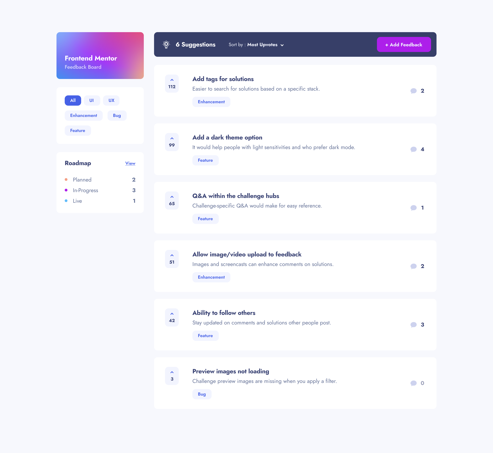

# Product Feedback App

### [Live Site](https://your-live-site-url.com)

## Table of contents

- [Product Feedback App](#product-feedback-app)
    - [Live Site](#live-site)
  - [Table of contents](#table-of-contents)
  - [Overview](#overview)
  - [Built with](#built-with)
  - [Author](#author)

## Overview

Users should be able to:

- Switch to any user
- View the optimal layout for the app depending on their device's screen size
- See hover states for all interactive elements on the page
- Create, read, update, and delete product feedback requests
- Receive form validations when trying to create/edit feedback requests
- Sort suggestions by most/least upvotes and most/least comments
- Filter suggestions by category
- Add comments and replies to a product feedback request
- Upvote product feedback requests
- Keep track of any changes, even after refreshing the browser

## Built with

- [React](https://react.dev/) - JS library
- [Styled Components](https://styled-components.com/) - Styling
- [React-hook-form](https://react-hook-form.com/) - Form management
- [Redux Toolkit](https://redux-toolkit.js.org/) - State management

## Author
  - [Portfolio](https://portfolio-selly361.vercel.app/)
  - [Linkedin](https://www.linkedin.com/in/seikou-sillah-883912249/)

